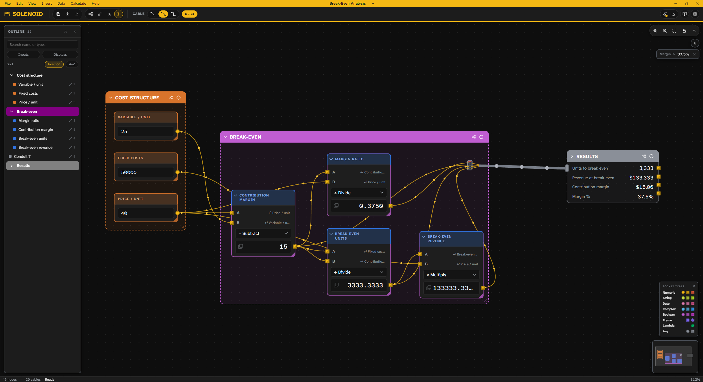
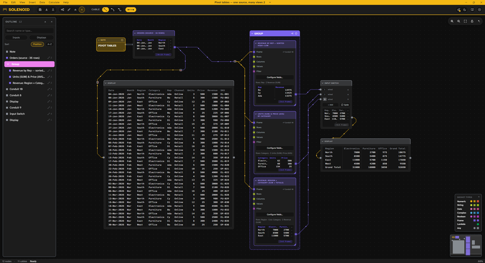

# Solenoid


Solenoid is a node graph calculator visual alternative to Excel and other spreadsheet software. It features a near-parity set of Excel functions, plus data type separation and unit passthrough. Many additional functions and utilities are included alongside the Excel set, and you can extend its functionality with added node packs. 




## Data Type Separation

Solenoid distinguishes between the Numeric, String, Date, Complex, & Boolean data types and doesn't allow you to mistakenly wire a data type to a function which doesn't accept it. It also enforces a dimensionality pattern- singular values can flow into 1-D lists (CSV rows), which can flow into 2-D arrays of a uniform data type, and the reverse is blocked.

### Additional Data Types

The Frame data type consists of uniform data type columns with headers. The Cube type is a 3D Frame where columns can themselves hold Frames, allowing you to nest data and quickly drill down like you'd do in Excel's Power Query.

## Unit Passthrough

The Format Controller node allows you to assign both a display format and units to your data. A given datum with an assigned unit (such as USD, radians, or square meters) is locked to that unit until it's transformed by some other function. 


## Expressions

The Expression node takes a typed formula like `mu0 * N / L * I` and turns each variable into an input socket. You write the parts of a calculation that are faster typed and wire the parts that are clearer as a graph, rather than committing to one or the other.

## Table Operations

Beyond per-value math, Solenoid covers the relational work a spreadsheet usually hands off to Power Query or SQL. Joining tables on a key, grouping and aggregating, and pivoting are each a node, so a multi-step query reads as a diagram instead of a stack of recorded steps you can't see into. On the desktop build these run on the native Polars engine.



## Try it

[solenoid-ngc.vercel.app](https://solenoid-ngc.vercel.app) runs in your browser with no install and no account. Many example seed graphs are included for you to test out.

## Desktop

The desktop version is a WIP. It offers a Rust (Polars) backend for memory-heavy operations. 

## From source

The **web build** needs only [Node](https://nodejs.org) (20+) — no Rust:

```
npm install
npm run dev          # http://localhost:1420, hot reload
```

The **desktop build** additionally needs the [Rust toolchain](https://rustup.rs) and
Tauri's platform prerequisites — on Windows: the WebView2 runtime (preinstalled on
Windows 11) and the MSVC C++ build tools, see
[tauri.app/start/prerequisites](https://tauri.app/start/prerequisites/). Desktop is
**Windows-only** for now.

```
npm run tauri dev    # runs the desktop window live (starts the frontend itself)
npm run tauri build  # production build → src-tauri/target/release/
```

`tauri build` emits the portable `solenoid.exe` plus an installer under
`target/release/`; add `-- --no-bundle` to skip the installer and build just the exe.

## License

MIT, see [LICENSE](LICENSE). Third-party credits are in [THIRD-PARTY-NOTICES.md](THIRD-PARTY-NOTICES.md).

