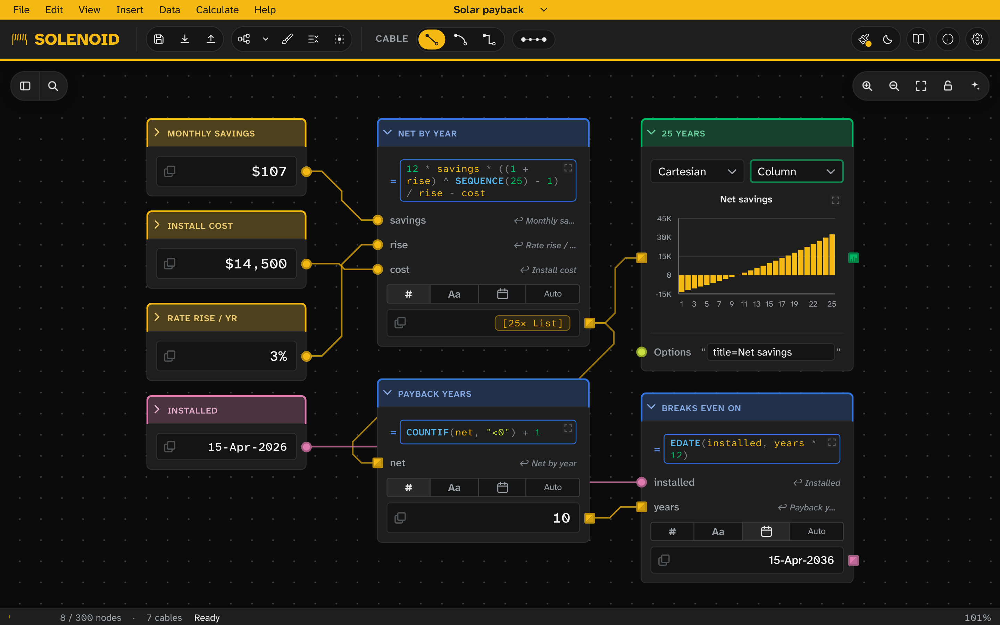
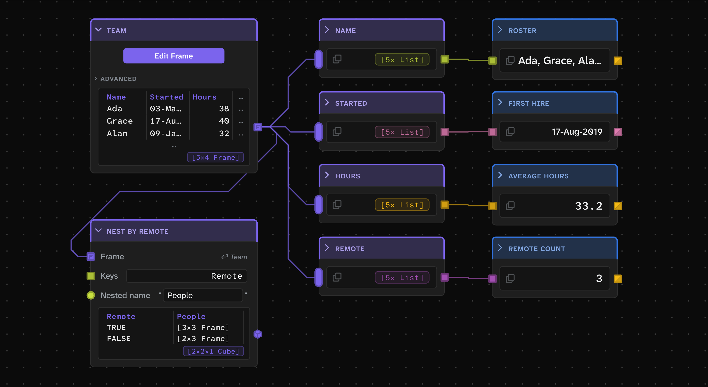
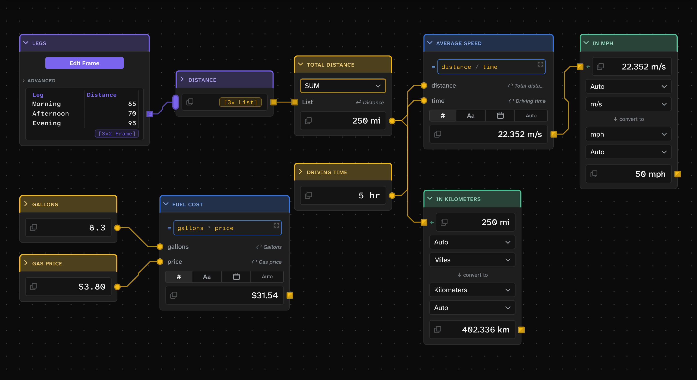
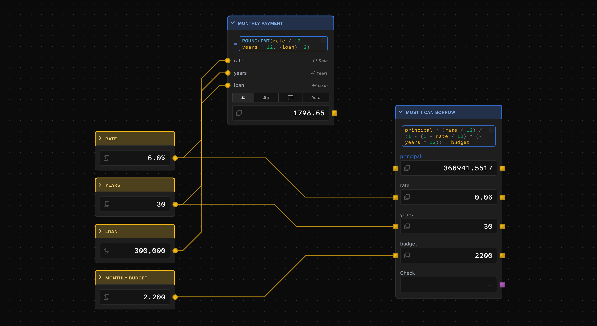
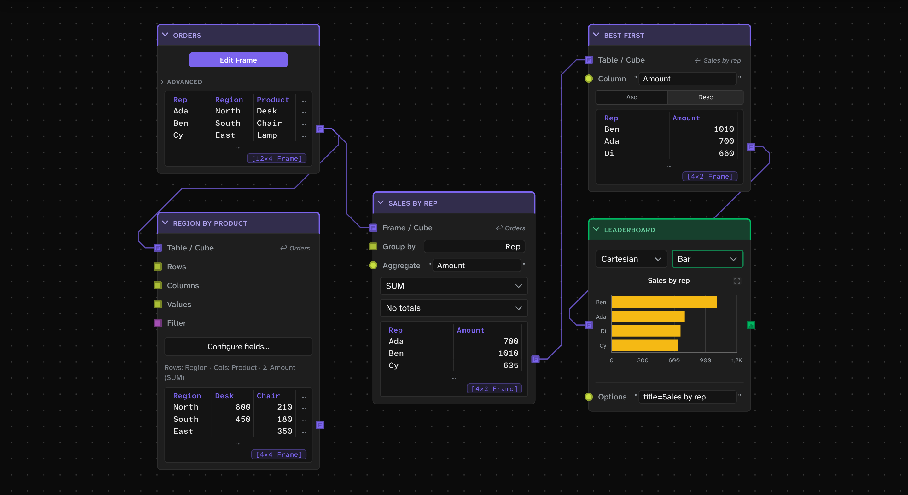
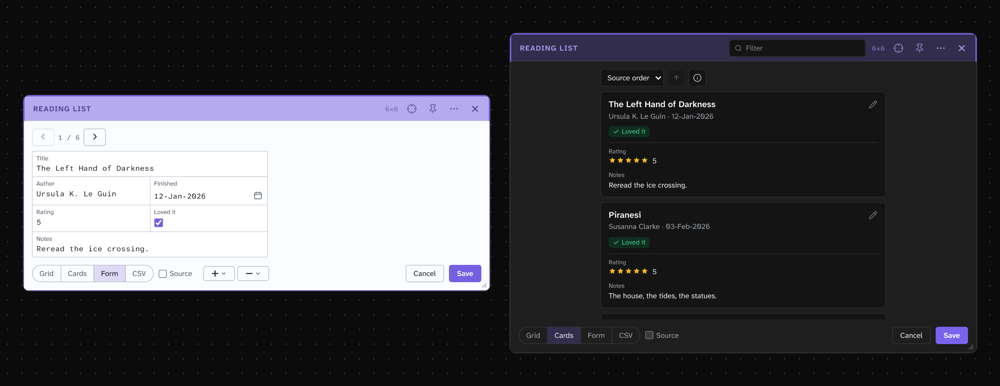
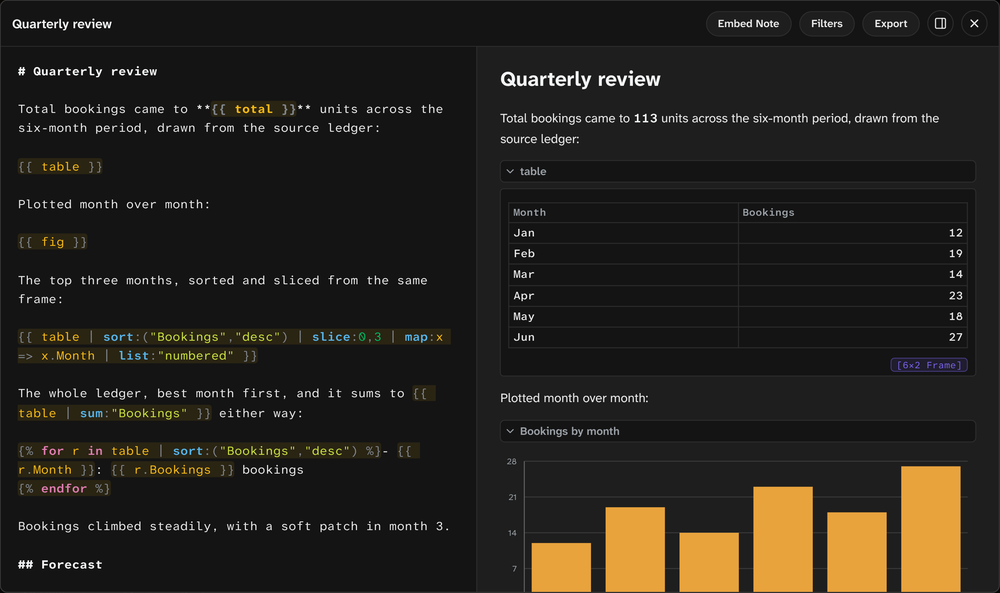
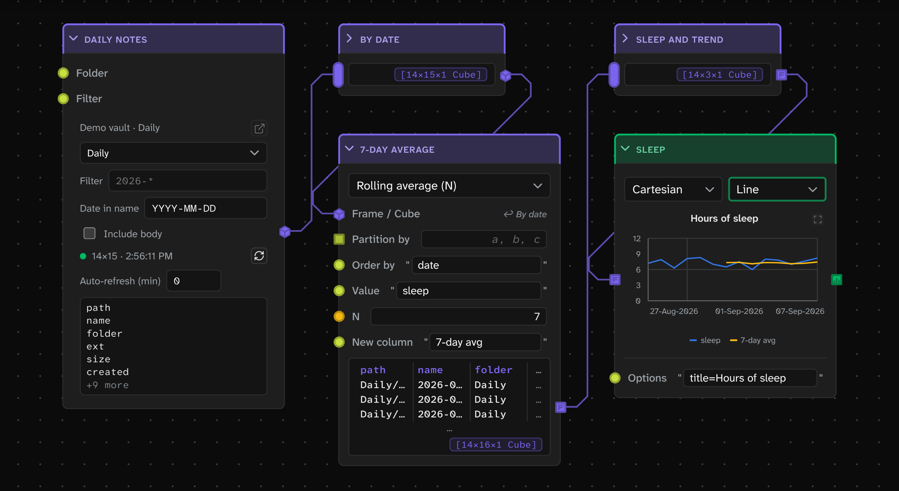

# Solenoid

Solenoid is a node graph calculator visual alternative/companion to Excel. It contains all relevant Excel functions, plus many additional functions and utilities. 



## Data Type Separation

Solenoid distinguishes between the Numeric, String, Date, Complex, & Boolean data types and doesn't allow you to mistakenly wire a data type to a function which doesn't accept it. It also enforces a dimensionality pattern- singular values can flow into 1-D lists (CSV rows), which can flow into 2-D arrays of a uniform data type, and the reverse is blocked.

### Dimensionality

Solenoid sockets also carry information about their dimensionality for their inputs and outputs. A value can be a Scalar, List (1-D CSV row), Matrix (2-D CSV), Frame, or Cube.

The Frame object consists of uniform data-type columns with headers. The Cube object is a 3D data table where cells can themselves hold any value or dimensioned object, allowing you to nest arrays within arrays and quickly drill down to the data you need.



## Unit Passthrough

The Value Input and Format Controller nodes assign both a display format and units to your data. A value with an assigned unit (such as USD, radians, or square meters) is locked to that unit until transformed by some other function, so a value of 5 with the unit "meters", multiplied by 2, will become 10+"meters". 



## Formula Surface

The Expression (1-way) and Equation (2-way) nodes allow you to input formulas for any node in typical Excel syntax. The LAMBDA node allows you to input a formula which can be re-used in various places. 



## Data Operations

Solenoid contains the table verb nodes for which you'd normally need to use Power Query. These operate on Frames and Cubes; table verb nodes are not accessible via the Formula input surfaces. 



## Form Input and Records

The Frame Input node allows you to define a custom Form Input layout for inputting and browsing records with checkboxes and date pickers. The Record node lets you browse records and renders them as a Chart for re-use.



## Document Surface

- The Note node is a free-floating in-canvas markdown text box node which takes YAML frontmatter and exposes the values as output sockets. 
- The Report node allows you to write a markdown document in Knap, Obsidian's template language: `{{ name }}` defines an input socket and renders the wired value inline with the text. You can input values, lists, tables, and even Charts directly into a markdown document for easy report generation, or wire a table into the Records socket to generate one page per row.
- On the desktop version of the app, define an Obsidian vault folder to import and write notes directly to the vault, read a whole folder of notes as one table, and pull tasks from the TaskNotes plugin. The web version bundles a demo vault so you can try it without one.





## Try it

[solenoid-ngc.com](https://solenoid-ngc.com) runs in your browser, on desktop and mobile. For improved performance, you can enable the HTML-in-Canvas experimental Chrome flag and enable usage of that renderer in Settings.

## Unsupported Features

- Accounts, cloud sync, multiplayer editing
- Conditional Formatting in tables

## Desktop

The desktop app (Windows and Linux) runs the relational verbs on a native Rust (Polars) engine for memory-heavy tables. The web build uses an identical in-process JS engine.

## From source

The **web build** needs only [Node](https://nodejs.org) 20+, no Rust:

```
npm install
npm run dev          # http://localhost:1420, hot reload
```

The **desktop build** additionally needs the [Rust toolchain](https://rustup.rs) and
Tauri's platform prerequisites, see
[tauri.app/start/prerequisites](https://tauri.app/start/prerequisites/). On Windows: the
WebView2 runtime (preinstalled on Windows 11) and the MSVC C++ build tools. On Linux:
WebKitGTK 4.1 and the build packages that page lists for your distro.

```
npm run tauri dev    # runs the desktop window live (starts the frontend itself)
npm run tauri build  # production build → src-tauri/target/release/
```

On Windows `tauri build` emits the portable `solenoid.exe` plus an installer under
`target/release/`; on Linux, the `solenoid` binary plus an AppImage, a `.deb` and an `.rpm`.
Add `-- --no-bundle` to build just the binary.

## License

MIT, see [LICENSE](LICENSE). The node canvas is built on [React Flow](https://reactflow.dev) by [xyflow](https://xyflow.com); the graph model runs on [Rete.js](https://retejs.org) and the desktop relational engine is [Polars](https://pola.rs). Full third-party credits are in [THIRD-PARTY-NOTICES.md](THIRD-PARTY-NOTICES.md).

